# ROS2-MoveIt2 UR5-Optoforce 3D objects tactile exploration

## Introduction and Requirements
### Context and Motivation
Tactile exploration of three-dimensional surfaces and objects is a critical task in various fields of robotics. Whether for industrial applications, medical use, or research, the ability to sense and manipulate objects accurately is essential. In this project, we use an Optoforce force sensor and a UR5 robotic arm to explore the surfaces of objects through touch. This sensor, mounted on the end-effector (EE) of the UR5, measures forces in three dimensions, providing valuable data for reconstructing the surface of the object in a 3D point cloud format.

### Objectives
The primary goal of this project is to develop a method for tactile exploration and reconstruction of object surfaces using the Optoforce force sensor and the UR5 robotic arm. Specifically, we aim to create a 3D mesh of the object by recording the positions and orientations of the sensor along with the force measurements as it makes contact with the surface. The specific tasks include:
* Designing and fabricating a flange to securely attach the Optoforce sensor to the UR5's end-effector.
* Developing methods to precisely control the robotic arm's movement to systematically explore the object's surface.
* Creating movement trajectories for the end-effector based on approximate surface information of the object.
* Combining spatial data (location and orientation) with the force measurements from the Optoforce sensor to reconstruct the object’s surface as a 3D point cloud.

## Tools and Technologies
  
* The **Optoforce OMD-30-SE-100N** sensor is a specialized device designed for high-precision force measurement in three dimensions. Utilizing optical technology, it accurately detects forces applied across its surface and converts these measurements into digital signals for real-time analysis. This sensor model is particularly suited for applications requiring precise force feedback during interactions with objects. Key features include its capability to measure forces along the X, Y, and Z axes up to 100N, making it suitable for tasks demanding fine control and manipulation. Its compact size allows seamless integration into robotic end-effectors without compromising the robot's operational flexibility. The digital output of the Optoforce sensor facilitates straightforward interfacing with robotic controllers and simulation environments, supporting tasks that require detailed force sensing capabilities in industrial and research applications.
* The **UR5 robotic arm**, developed by Universal Robots, is a versatile solution designed for various industrial automation tasks. With six degrees of freedom, the UR5 offers extensive maneuverability, enabling it to reach diverse positions and orientations with precision. Its collaborative design ensures safe operation alongside human workers, making it suitable for environments requiring human-robot interaction. The UR5's payload capacity of up to 5 kg supports a wide range of applications, from assembly and machine tending to research and development tasks. Intuitive programming interfaces, including teach pendants and software APIs, simplify task programming and execution, catering to users with varying levels of expertise. Compact and lightweight, the UR5 is designed for easy integration into existing production lines, providing robust performance and reliability across industrial sectors.

## Related work

### 3D Design and Fabrication

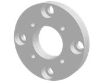

To mount the Optoforce sensor onto the UR5 robotic arm's end-effector, we first designed a custom fixture using SolidWorks. This fixture, or bracket, ensures precise alignment and stability during tactile exploration tasks. The design process involved creating detailed 3D models of both the sensor and the end-effector to ensure a perfect fit. Once the design was finalized, we prepared it for 3D printing, ensuring the physical part would be robust enough to handle the forces exerted during operation.

### SolidWorks Assembly for UR5 Integration 

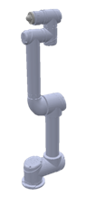
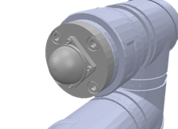

Next, we created a comprehensive assembly in SolidWorks that included the [UR5 robotic arm](https://grabcad.com/library/ur5-8), the custom fixture, and the Optoforce sensor. This assembly allowed us to visualize and verify the mechanical integration of all components. It also served as a reference for the simulation environment, ensuring that the virtual model matched the physical setup.

### Conversion to URDF for Simulation
Thanks to an installed [SolidWorks module](https://github.com/ros/solidworks_urdf_exporter/releases), the assembly was then converted into the Unified Robot Description Format (URDF), which is essential for integrating the robotic arm into simulation environments. The URDF file includes detailed descriptions of the robot's joints, links, and sensors, allowing for precise simulation of its movements and interactions.

## Simulation
### Pybullet Simulation 

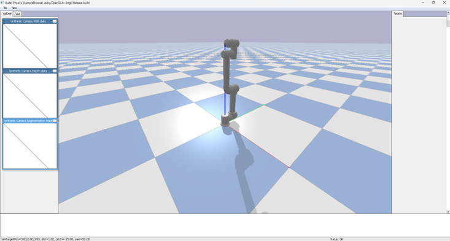

We initially used Pybullet for simulating the UR5 and Optoforce sensor setup thanks to the [guide](https://docs.google.com/document/d/10sXEhzFRSnvFcl3XxNGhnD4N2SedqwdAvK3dsihxVUA/edit). Pybullet is known for its physics-based simulation capabilities, which we hoped would allow us to accurately model the interactions between the sensor and various objects. However, we faced significant challenges with URDF compatibility and some issues with the inverse kinematics function. Pybullet's specific requirements for URDF formatting and its limitations in handling complex sensor data made it difficult to achieve the level of simulation fidelity we needed. Additionally, integrating the Optoforce sensor with Pybullet proved complex and unreliable, leading us to seek more robust solutions.

### ROS2 simulation
#### Transition to ROS2 Iron and MoveIt2

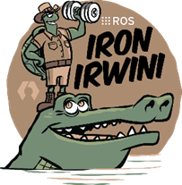
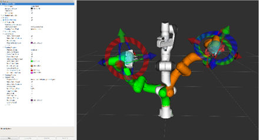

Due to the limitations encountered with Pybullet, we transitioned to ROS2 Iron, using MoveIt2 for our simulation needs. ROS2 Iron offers extensive support for robotic systems and is designed to handle complex tasks involving multiple sensors and actuators. MoveIt2 provided powerful tools for motion planning and manipulation, essential for our project. This intuitive interface allowed us to generate and visualize trajectories, ensuring the robot could perform the desired movements.

#### ROS2 Iron and MoveIt2 Installation
Installing ROS2 Iron and MoveIt2 was a meticulous process. The installation required careful attention to dependencies and system configurations. 
* On dual-boot systems, like on Alexis's laptop, this proved particularly challenging, with various compatibility issues like many warnings and some not working features. 
* On virtual machines (VM), like Souha's, resource constraints led to extended build times, but the installation was done correctly. 
To streamline this process for future iterations, we created a detailed bash script to automate the installation of ROS2 Iron and its dependencies, which we made available in our repository. But you can follow the documentations guidelines

#### Workspace Creation and MoveIt2 tutorial

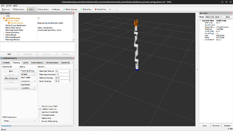
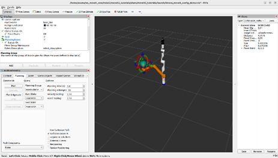

Once ROS2 Iron and MoveIt2 were installed, we created a workspace to house our project's code and dependencies. This involved cloning MoveIt tutorial repositories and integrating them into our workspace. Building the workspace thanks to colcon was time-consuming (1 hour in dual boot system / 2 hour in VM) but was necessary to ensure all components were correctly configured and could communicate seamlessly. Thanks to the tutorial Souha was able to move the robot and plan trajectory where Alexis’s configuration/installation generate warnings and can’t enable the movement planning feature.
With these considerations we plan to realize the next steps of the project on the Souha laptop through the virtual machine.

#### UR5 and optoforce implementations

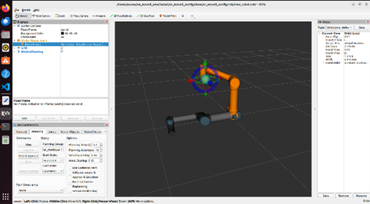
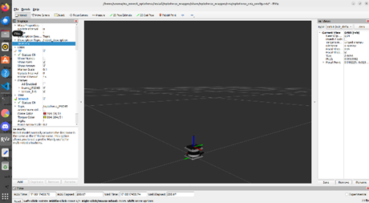

After realizing the basic tutorials, we plan to implement the UR5 robot into the Moveit2 simulation. For that we create a new workspace, clone all the repository (UR5 robot ROS2 driver & optoforce ROS2 driver) and build it thanks Colcon, for a clear and realistic simulation with all the ROS2 topics already configured by the constructor (in the case of the UR5 robot). And now, we can launch the UR5 robot, realize multiple trajectories with the robot and independently launch the optoforce sensor in another window. 

As we can see, the optoforce sensor isn’t the good one (OMD-20-FE-200N and not the OMD-30-SE-100N) and it’s the only repository for ROS2 driver that we found. And we figure out that, in simulation, we can’t have data from the sensor. We need the optoforce sensor plugged. That’s what we plan to work differently with using only the UR5 joints torque to detect the object and generate the 3D point cloud.

#### Create our first C++ code to perform trajectories around objects in MoveIt2
For that we need to create our first C++ code link to Moveit helped by the Moveit tutorials. This C++ code (that you can find on Github) is a MoveIt2 application for robot motion planning using ROS 2. The code performs the following main tasks:
* Initializes ROS 2 and creates a node named "hello_moveit" and sets up a logger and a single-threaded executor for handling ROS callbacks.
* Creates a `MoveGroupInterface` object to control a robotic manipulator named "manipulator" and sets up `MoveItVisualTools` for visualizing robot states and motion in Rviz, a 3D visualization tool.
* Defines helper functions for visualizing text and robot trajectories in Rviz.
* Sets a target pose for the robotic manipulator with specific orientation and position values (X, Y, Z).
* Defines a collision object (a box) that the robot should avoid while planning its path and adds this collision object to the planning scene.
* Prompts the user to initiate the planning process, attempts to plan a path to the target pose. If successful, visualizes the planned trajectory and prompts the user to execute it.
* Finally, shuts down the ROS 2 node and joins the spinner thread.

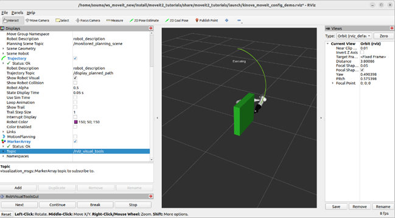

#### Modify the algorithm for iterative collision contact
Then, we modify the C++ code to perform tactile exploration. The improvements include the addition of a function that iteratively moves the robotic manipulator around a defined collision object, making slight contact at various points. For each position, the code plans and executes the movement, then checks and logs the joint torques to detect contact with the object. This helps in identifying when the end-effector touches the object. The enhancements also include the definition of multiple targets poses arranged in a circular pattern around the collision object, ensuring comprehensive surface exploration. The robot's end-effector position and joint torques are recorded for each contact point, facilitating data fusion for tactile sensing and further analysis. 
You can find a not stable C++ code in Appendix 1. But, due to various challenges, this part is not yet completed, and we plan to finish it in the coming days.

#### Displaying collisions and integrate the UR5 robot
Finally, we plan to display collisions by utilizing the data fusion obtained from the previous step, with the assistance of a specific ROS tutorial. However, since the tutorial is in ROS and not in ROS 2, we need to adapt it.
After that, we want to integrate our UR5 robot into MoveIt2 simulation and perform the 3D tactile exploration algorithm.
Due to various challenges, this part is not yet completed, but we plan to finish it in the coming days.

## Conclusion
In conclusion, our project aimed to develop a method for tactile exploration and 3D reconstruction of object surfaces using an Optoforce force sensor and a UR5 robotic arm. We successfully designed and fabricated a custom fixture, created detailed 3D models, and integrated these components into simulation environments using SolidWorks and ROS2 Iron with MoveIt2. Despite challenges with Pybullet compatibility and Optoforce sensor integration, we made significant strides in setting up simulations and developing initial algorithms in C++ for executing tasks within MoveIt2. Our future work will focus on refining the tactile exploration algorithm, improving simulation fidelity, and implementing collision display. Overall, our progress has laid a solid foundation for achieving precise and reliable tactile sensing, with potential applications in various fields of robotics.

